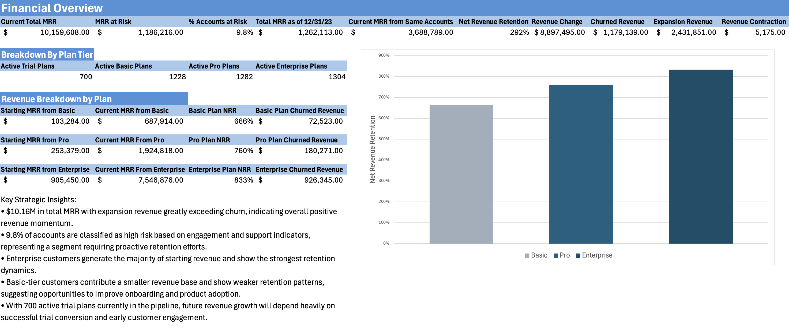

# SaaS Revenue Retention & Customer Health Analysis

## Project Overview

This project analyzes the customer lifecycle, revenue retention, and engagement health of a fictional SaaS company, **RavenStack**, using subscription, usage, and support data. The goal was to simulate the type of analysis a **Product Analyst, Business Operations Analyst, or Revenue Operations Analyst** might conduct to understand customer retention dynamics and identify revenue risks.

The analysis integrates multiple operational datasets—including subscriptions, product usage, support tickets, and account attributes—to build a unified customer model. From this foundation, the project evaluates **Net Revenue Retention (NRR), churn risk indicators, customer engagement patterns, and plan-level revenue performance**.

The final output is an executive-style dashboard summarizing the company's revenue health and highlighting actionable areas for improving retention and expansion.

## Executive Dashboard

---

## Dataset

The dataset represents a **mock SaaS platform called RavenStack** and was sourced from Kaggle. It includes several related tables that simulate real SaaS operational data:

### Core Tables

* **Accounts**

  * Customer attributes such as industry, country, signup date, plan tier, and seat count.

* **Subscriptions**

  * Subscription lifecycle events including plan tier, billing frequency, MRR/ARR values, and upgrade or downgrade activity.

* **Feature Usage**

  * Product engagement metrics including feature usage counts, session duration, error rates, and beta feature usage.

* **Support Tickets**

  * Customer support interactions including ticket priority, resolution time, escalation flags, and satisfaction scores.

* **Churn Events**

  * Records identifying when accounts churned.

Using these sources, the project constructs a **master customer table** that aggregates behavioral, financial, and operational metrics at the account level.

---

## Tools & Techniques Used

This analysis was conducted primarily in **Microsoft Excel**, demonstrating how complex SaaS analytics workflows can be performed without specialized BI software.

Key techniques included:

**Data Modeling**

* Relational joins across multiple datasets using `XLOOKUP`
* Aggregations using `SUMIFS`, `COUNTIFS`, and `AVERAGEIFS`
* Structured Excel Tables for scalable calculations

**Feature Engineering**

* Customer engagement metrics (usage per seat, error rates)
* Support burden indicators (tickets per account, escalation rate)
* Customer health classification (high-risk accounts)

**Revenue Analytics**

* Current Monthly Recurring Revenue (MRR)
* Revenue expansion, contraction, and churn decomposition
* Trailing 12-month **Net Revenue Retention (NRR)** modeling
* Plan-tier revenue segmentation

**Visualization**

* Executive dashboard summarizing key revenue metrics
* Scatter analysis linking engagement and revenue
* Plan-tier NRR comparison chart

---

## Key Metrics Modeled

The model calculates several core SaaS metrics:

* **Monthly Recurring Revenue (MRR)**
* **Annualized Recurring Revenue (ARR)**
* **Net Revenue Retention (NRR)**
* **Revenue Churn**
* **Revenue Expansion**
* **Revenue Contraction**
* **Customer Risk Segmentation**

These metrics provide a holistic view of both **financial performance and customer health**.

---

## Key Insights

Analysis of the RavenStack dataset surfaced several important patterns:

* **Strong Net Revenue Retention**

  * Expansion revenue slightly exceeds churn, resulting in positive net retention across the existing customer base.

* **Enterprise Customers Drive Revenue Stability**

  * Enterprise-tier customers contribute the majority of starting revenue and show the strongest retention characteristics.

* **Starter / Basic Plans Exhibit Higher Risk**

  * Smaller accounts show weaker retention patterns and lower engagement, suggesting onboarding and adoption challenges.

* **Customer Engagement Correlates With Retention**

  * Accounts with low product usage and higher support escalation rates show a significantly higher likelihood of churn.

* **High-Risk Segment Identified**

  * Approximately ~10% of accounts fall into a high-risk category based on behavioral indicators, representing a meaningful portion of revenue that may require proactive intervention.

* **Trial Conversion Represents a Growth Opportunity**

  * Hundreds of active trials remain in the pipeline, representing potential future MRR if conversion and onboarding are optimized.

---

## Important Note on Dataset Realism

Because this dataset is synthetic, some of the resulting financial metrics (such as extremely high Net Revenue Retention values) may appear unusually strong compared to typical SaaS benchmarks.

In real-world SaaS businesses:

* NRR typically ranges from **90%–120%**
* Extremely high values (such as several hundred percent) are unlikely without exceptional expansion dynamics.

The purpose of this analysis is therefore **methodological rather than predictive**—demonstrating how retention analytics can be built and interpreted rather than reflecting realistic business performance.

---

## Recommended Business Actions

Based on the insights generated from this analysis, a SaaS leadership team could consider several strategic actions:

**1. Improve Early Customer Onboarding**

* Lower-tier customers show weaker engagement patterns.
* Investing in onboarding and activation programs could reduce early churn.

**2. Expand Account Growth Programs**

* Enterprise customers demonstrate strong expansion potential.
* Dedicated account management or expansion campaigns could further drive revenue growth.

**3. Proactively Monitor At-Risk Accounts**

* Behavioral signals such as low usage and high support escalations should trigger early intervention.

**4. Optimize Trial Conversion**

* With hundreds of active trials in the pipeline, improving trial onboarding and conversion funnels could significantly increase revenue.

**5. Track Engagement Metrics as Leading Indicators**

* Product usage data provides early warning signals before churn occurs.
* Incorporating these metrics into a customer health scoring model would allow earlier intervention.

---

## Project Outcome

This project demonstrates how operational, behavioral, and financial SaaS data can be integrated to produce actionable retention insights. The resulting dashboard and analytical framework mirror the types of models used by **product analytics, revenue operations, and customer success teams** to monitor business health and guide strategic decision-making.

---

## Author

Jacob Leischner
Master of Science in Engineering, Science & Technology Entrepreneurship (ESTEEM)
University of Notre Dame
